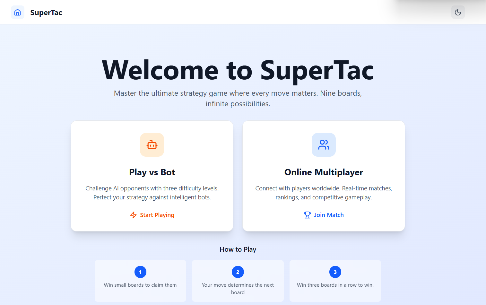
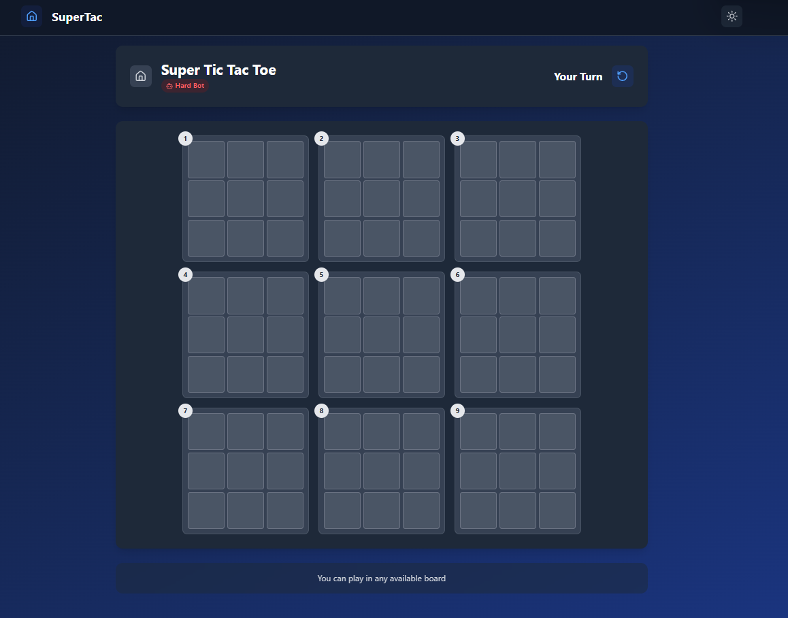

# SuperTac - Ultimate Tic Tac Toe Game

SuperTac is a modern, feature-rich implementation of Ultimate Tic Tac Toe with both single-player and multiplayer modes. The game features an elegant user interface with **light and dark** theme support, various AI difficulty levels, and real-time multiplayer functionality.




## Table of Contents

- [Features](#features)
- [Technologies Used](#technologies-used)
- [Installation](#installation)
- [Running Locally](#running-locally)
- [Game Modes](#game-modes)
- [Bot Difficulty Levels](#bot-difficulty-levels)
- [Multiplayer Features](#multiplayer-features)
- [UI/UX Features](#uiux-features)
- [Project Structure](#project-structure)
- [Future Improvements](#future-improvements)

## Features

- **Single-player mode** with three difficulty levels of AI opponents
- **Multiplayer mode** with room creation and joining functionality
- **Random matchmaking** for quick games with other online players
- **Modern, responsive UI** with light and dark theme support
- **Real-time gameplay** using WebSocket communication

## Technologies Used

### Frontend

- React 19
- Vite
- TailwindCSS
- Framer Motion for animations
- Socket.io client
- Lucide React for icons

### Backend

- Node.js
- Express
- Socket.io
- CORS handling

## Installation

1. Clone the repository:

   ```bash
   git clone https://github.com/kevin-eleven/supertac.git
   cd supertac
   ```

2. Install the dependencies for both frontend and backend:

   ```bash
   # Install backend dependencies
   cd backend
   npm install

   # Install frontend dependencies
   cd ../frontend
   npm install
   ```

## Running Locally

1. Start the backend server:

   ```bash
   cd backend
   npm run dev
   ```

2. In a new terminal, start the frontend development server:

   ```bash
   cd frontend
   npm run dev
   ```

3. Open your browser and navigate to [http://localhost:5173](http://localhost:5173)

## Game Modes

### Single-player

Play against an AI bot with varying difficulties. The game follows the rules of Ultimate Tic Tac Toe:

- Win three small boards in a row to win the game
- Your opponent's move determines which board you play in next
- Win a small board by getting three in a row within it

### Multiplayer

Connect and play with other users in real-time. Create your own game room or join an existing one.

## Bot Difficulty Levels

SuperTac features three AI difficulty levels, each using different strategies:

### Easy

- Uses **random move selection** from available legal moves
- Perfect for beginners or casual play
- Simple implementation without strategic planning

### Medium

- Implements the **Minimax algorithm** with **Alpha-Beta pruning**
- Evaluates potential moves to a medium search depth (3 levels)
- Balances computation efficiency and strategic play
- Provides a moderate challenge for average players

### Hard

- Uses enhanced **Minimax algorithm** with **deeper search depth** (4 levels)
- Employs advanced board evaluation heuristics
- More aggressive and strategic gameplay
- Provides a significant challenge even for experienced players

The bot AI implementation uses position evaluation to determine optimal moves, considering:

- Board control
- Potential winning lines
- Blocking opponent's winning opportunities

## Multiplayer Features

SuperTac offers a comprehensive multiplayer experience with the following features:

### Room Creation

- Create private game rooms with custom names
- Receive a unique room ID to share with friends

### Room Joining

- Join specific rooms using room IDs
- User-friendly interface for entering room codes

### Random Matchmaking

- Quick-play option to match with any available player
- Automatic pairing with waiting players

### Real-time Gameplay

- Instant move updates via WebSocket communication
- Player turn indicators
- Game state synchronization across clients

## UI/UX Features

### Modern Interface

- Clean, intuitive game board design
- Responsive layout that works on various screen sizes
- Smooth animations for game interactions

### Theme Support

- Light mode for daytime play
- Dark mode for comfortable night-time gaming
- Persistent theme selection saved in local storage

### Visual Feedback

- Highlighted active boards
- Clear indication of legal move areas
- Win/loss/draw status indicators
- Player turn and game progress indicators

## Project Structure

### Frontend

```
frontend/
├── public/           # Static assets
├── src/
│   ├── assets/       # Images and other media
│   ├── components/   # UI components
│   ├── contexts/     # React contexts
│   ├── hooks/        # Custom React hooks
│   ├── pages/        # Page components
│   ├── services/     # API and socket services
│   ├── stores/       # State management
│   ├── utils/        # Helper functions and game logic
│   ├── App.jsx       # Main application component
│   ├── index.css     # Global styles
│   └── main.jsx      # Entry point
```

### Backend

```
backend/
├── config/           # Configuration files
├── controllers/      # Request controllers
├── middlewares/      # Express middlewares
├── models/           # Data models
├── routes/           # API routes
├── services/         # Business logic services
├── utils/            # Helper functions
├── app.js            # Express application setup
└── server.js         # Server entry point
```

## Future Improvements

- Game history and statistics tracking
- User accounts and authentication
- Leaderboards and rankings
- In-game chat functionality
- More game customization options
- Mobile app version

---

Created with ❤️ by Haris
